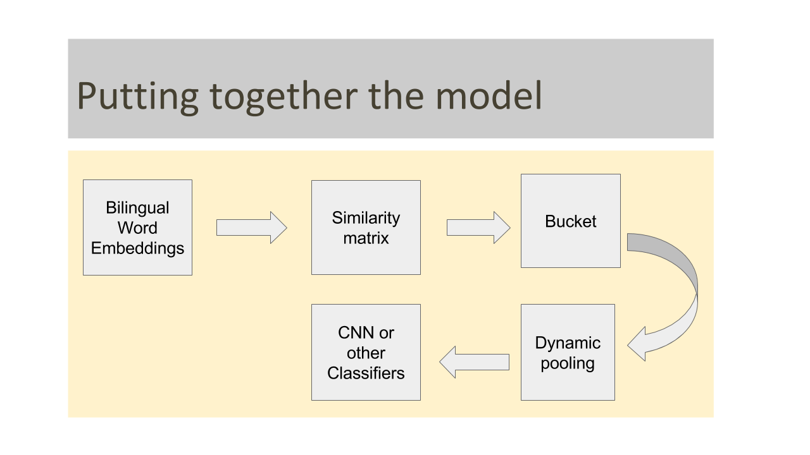

# Bilingual Word Embeddings with Bucketed CNN for Parallel Sentence Extraction

A [TensorFlow](https://github.com/tensorflow/tensorflow) implementation of our recent paper in ACL 2017(Student track) ([Bilingual Word Embeddings with Bucketed CNN for Parallel Sentence Extraction.](http://www.aclweb.org/anthology/P17-3003))

Two sentences are said to be aligned or semantically similar if they convey the same semantics in both the languages. Our code makes use of the Bilingual Word Embeddings for capturing the smetic s related of two words across languages.
A similarity matrix is constructed between the words of two sentences, which is dynamically pooled to a fixed size dimension 'dim' for classification tasks.
We split the data into different bucket sizes as one fixed size representation would not work effectively for all sentence-pair sizes. Separate CNN's were trained on each data split.

## Pre-requisites

* Python 2.7
* TensorFlow
* Numpy
* Scikit Learn
* Matplotlib

## Usage

To replicate the result from our paper, use the testing command below.

    $ python main.py

The results would be appended at the end of corresponding files in the results folder. If you want to retrain the model, then uncomment the lines specified in the main.py

## Attribution / Thanks

* Bilingual Word Representations with Monolingual Quality in Mind [Link](https://nlp.stanford.edu/~lmthang/bivec/)
* BUCC 2017 dataset[Link](https://comparable.limsi.fr/bucc2017/cgi-bin/download-sample.cgi?langs=de-en)

## License

MIT

